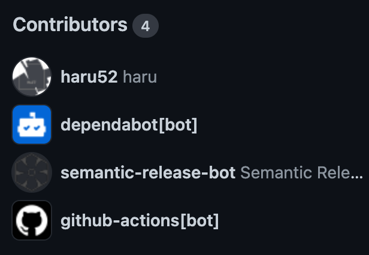
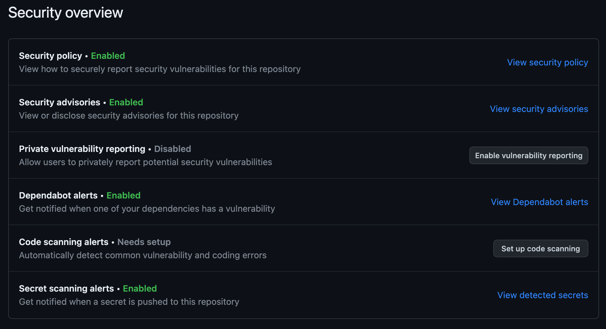

# Base Template Repository

## Overview

This is a fully automated template repository. You can use, extend and customize this template as you wish!

This template provides full compliance with [GitHub Community Standards](https://github.com/haru52/base_template/community). This template removes your pain to add boilerplates in the repo initialization phase ☺️

## Requirements

- GitHub account

## Installation

Nothing to do!

## Usage

1. Open this repo page on GitHub
2. Click `Use this template` button
3. Now you are ready to write code in a comfortable environment 🎉

## Update

To apply the latest Base Template files to a repo generated from this template, please use [Base Template CLI][base-template-cli].

## Uninstall

Nothing.

## Description

### Tech stack

| Category                      | Tool                                                                                  |
| ----------------------------- | ------------------------------------------------------------------------------------- |
| IDE/editor configuration      | [EditorConfig](https://editorconfig.org/)                                             |
| .gitignore management         | [gibo](https://github.com/simonwhitaker/gibo#readme)                                  |
| Git hook                      | [Husky](https://typicode.github.io/husky)                                             |
| Git commit I/F                | [Commitizen](https://commitizen.github.io/cz-cli/)                                    |
| CI/CD                         | [GitHub Actions](https://github.com/features/actions)                                 |
| Code review                   | [reviewdog](https://github.com/reviewdog/reviewdog#readme)                            |
| Release                       | [semantic-release](https://semantic-release.gitbook.io/semantic-release/)             |
| Dependency update             | [Dependabot](https://docs.github.com/en/code-security/dependabot)                     |
| Lint: Git staged              | [lint-staged](https://github.com/okonet/lint-staged#readme)                           |
| Lint: Git commit message      | [commitlint](https://commitlint.js.org/)                                              |
| Lint: credentials             | [Secretlint](https://github.com/secretlint/secretlint#readme)                         |
| Lint: Markdown                | [markdownlint-cli](https://github.com/igorshubovych/markdownlint-cli#readme)          |
| Lint: text (prose)            | [Vale](https://vale.sh/)                                                              |
| Lint: YAML                    | [yamllint](https://yamllint.readthedocs.io/)                                          |
| Lint: shell script            | [ShellCheck](https://github.com/koalaman/shellcheck#readme)                           |
| Lint: JSON, etc.              | [Prettier](https://prettier.io/)                                                      |
| Lint: GitHub Actions workflow | [actionlint](https://github.com/rhysd/actionlint#readme)                              |
| Lint: GitHub PR title         | [semantic-pull-request](https://github.com/marketplace/actions/semantic-pull-request) |

<!-- vale Microsoft.Headings = NO -->
### Community Standards
<!-- vale Microsoft.Headings = YES -->

### Security overview

Why `Code scannig alerts` feature isn't set up? Because this template has no code to scan! Of course you can set up this feature according to your project.

### Troubleshooting

If this solution doesn't resolve your problem, please [open an issue](https://github.com/haru52/base_template/issues/new/choose).

<!-- vale Microsoft.HeadingAcronyms = NO -->
#### CI fails
<!-- vale Microsoft.HeadingAcronyms = YES -->

1. Go to `https://github.com/<org>/<repo>/settings/actions`
2. If `Read and write permissions` option in `Workflow permissions` setting isn't selected, select it
3. If `Allow GitHub Actions to approve pull requests` isn't checked, check it
4. Click `Save` button

### Applying the templates to an existing repo

Please use [Base Template CLI][base-template-cli].

## Versioning policy

[Semantic Versioning 2.0.0](https://semver.org/spec/v2.0.0.html)

## License

[WTFPL](LICENSE)

## Languages

- English (this repo. original)
- [日本語](https://github.com/haru52/base_template_ja#readme)

## Contributing

[Contributing Guideline](CONTRIBUTING.md)

<!-- vale Microsoft.Vocab = NO -->
## Author
<!-- vale Microsoft.Vocab = YES -->

[haru](https://haru52.com/)

[base-template-cli]: https://github.com/haru52/base_template_cli#readme
